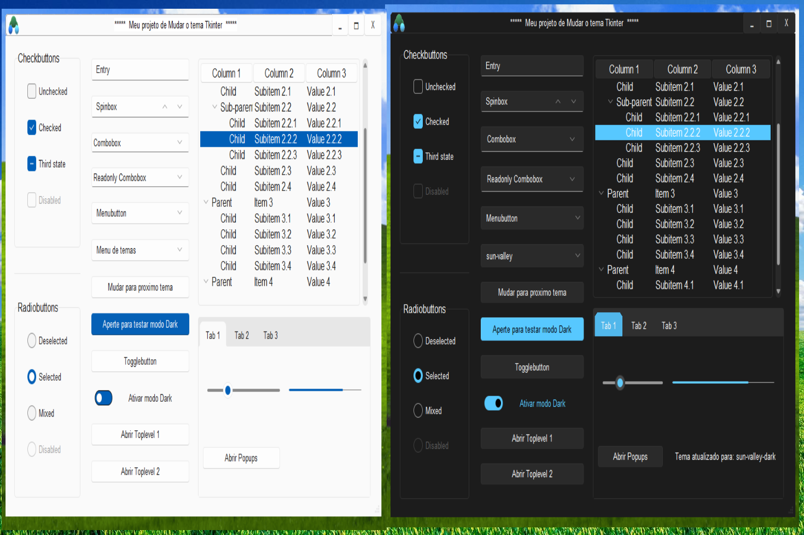

<h1 align="center">3 em 1 Temas de Tkinter</h1>

Depois de descobrir os lindos temas para Tkinter do rdbende, tive várias ideias de como aumentar a personalização dos seus 3 temas.
Assim, implementei uma nova barra de título, um atalho que se abre na barra de tarefas, um jeito diferente para abrir um toplevel personalizado e támbem adaptando o popup de diálogo do rdbende, tudo utilizando as cores dos temas e seus temas disponíveis.

Além disso, criei widgets que permitem alternar entre os três temas diretamente na interface e escolher entre os modos claro e escuro.
Adicionei um cursor personalizado que só funciona dentro da janela do Tkinter e está disponível apenas nos temas de modo escuro.
Para aumentar o desafio, fiz com que tudo funcionasse nos três sistemas operacionais: Windows, MacOS e Linux.

## Temas demo

## Dialogos demo

## Cursores demo

## Requesitos 

Atenção: Recomendo usar sempre um ambiente virtual para executar os códigos!!!

No sistema Windows:
    - Biblioteca Pillow. 
      Pode ser instalada com: pip install pillow
      
    - Biblioteca Pynput.
      Pode ser instalada com: pip install pynput
      
    - Pessoalizar ícone da janela do Python.
      Use o arquivo "remover_icon_do_python.py" (leia as instruções)

No sistema MacOS:
    - Biblioteca Pillow. 
      Pode ser instalada com: pip install pillow
      
    - Biblioteca Pynput.
      Pode ser instalada com: pip install pynput
      
    - Biblioteca Pyobjc.
      Pode ser instalada com: pip install pyobjc

No sistema Linux:
    - Biblioteca Pillow. 
      Pode ser instalada com: pip install pillow
      
    - Biblioteca Pynput.
      Pode ser instalada com: pip install pynput
      
    - Biblioteca Xlib.
      pode ser instalada com: pip install python-xlib
      
    - Biblioteca Tkxcursor.
      Para instalar, acesse meu repositório xcursor-personalizado-tkinter-linux e siga as instruções.
      
      Link:  https://github.com/rafa-nunes18/xcursor-personalizado-tkinter-linux 

## Testado com

Windows: Windows 11 PRO , versão 23H2.

MacOS: Big Sur , versão 11.2.3.

Linux: Mint 22 , versão 6.2.9.

Visual Studio Code , versão 1.93.1.

Python , versão 3.12.6.

Resource Hacker 5.2.7.

OBS: Utilizei VMware® Workstation 17 Player (versão 17.5.2) para criar máquinas virtuais com Linux e MacOS instalados.

## Inspirações

- Temas
    - Repositórios no GitHub de rdbende chamados, Tema Azure-ttk , Tema floresta-ttk, Tema Sun-Valley-ttk
    - https://github.com/rdbende/Azure-ttk-theme
    - https://github.com/rdbende/Forest-ttk-theme
    - https://github.com/rdbende/Sun-Valley-ttk-theme
    - rdbende (rdbende@proton.me)
    - https://matrix.to/#/@rdbende:matrix.org
    - @rdbende@mastodon.social 

- Classe ttk.Combobox
    Uma resposta de j_4321 no site https://stackoverflow.com/ 
    "Como alterar dinamicamente as cores do menu suspenso ttk.Combobox?"
    https://stackoverflow.com/questions/64755118/how-to-change-ttk-combobox-dropdown-colors-dynamically
    j_4321 (https://stackoverflow.com/users/6415268/j-4321)

- Barra personalizada
    O Video no YouTube de Codemy.com chamado "Custom Titlebar Hack! - Python Tkinter GUI Tutorial 188"
    https://www.youtube.com/watch?v=s0cpxPSN4k4
    Codemy.com (mail@codemy.com)
    https://codemy.com/

- Manter o ícone da janela do Python na barra de tarefas 
Repositório no GitHub de Terranova-Python chamado Barra de menu Tkinter
https://github.com/Terranova-Python/Tkinter-Menu-Bar
Terranova-Python (https://github.com/Terranova-Python)
https://terranovatech.info

- Criar ícone na barra de tarefas do Linux
    O Repositório no GitHub de Moisés-Palmer chamada pystray
    https://github.com/moses-palmer/pystray 
    Moisés-Palmer (https://github.com/moses-palmer)

## Desafios 

Este é o meu primeiro projeto, e enfrentei muitos desafios. Gostaria de destacar os mais problemáticos:

    - Ícone na barra de tarefas:
      Ao remover a barra de título padrão, o atalho desaparecia ou não era possível personalizá-lo.
      Portanto, cada sistema possui uma solução diferente.

    - Cursores:
      Para que os cursores possam ser modificados, eles precisam ter formatos e tamanhos específicos.
      A personalização no Linux, em particular, foi um grande desafio.

## Problemas

Novamente, este é o meu primeiro projeto então o uso deste código deve ser realizado com cautela.
Qualquer defeito ou erro resultante da execução deste código não será de minha responsabilidade, mas sim de quem o executar.
Certifique-se de entender completamente o que o código faz antes de utilizá-lo.

Se encontrar algum problema usando as versões dos sitemas por mim testado, entre em contato e vamos tentar juntos resolver. 

### Rafael A. Nunes (rafa.nunes2018@hotmail.com) 2024
### Instagran: @rafa33alves
